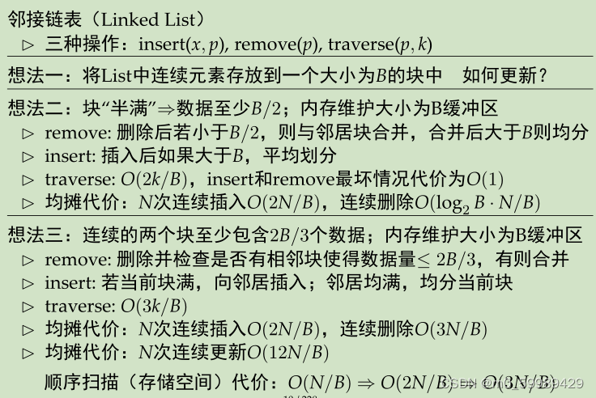
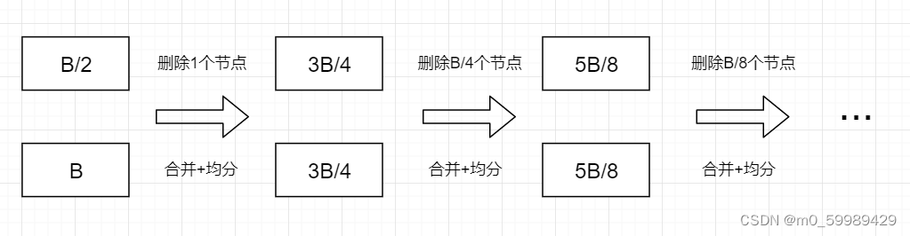

# External Memory Linked List

## 1 . Full Block with B
While linked lists efficiently support operations like insertion, deletion, and sequential access in memory, a naive implementation performs poorly in external memory (e.g., on disk). This is because each pointer traversal during a list scan may trigger a separate I/O operation, which is computationally expensive.

The solution is to preserve **locality** by storing logically adjacent elements within the same disk block. A natural idea is to group consecutive elements into blocks of size **B** and link those blocks. This allows traversing a list of length **N** in approximately **⌈N/B⌉** I/Os.

However, strictly enforcing exactly **B** elements per block (except possibly the last) makes maintenance under insertions and deletions inefficient. As argued in Exercise 3, certain updates could require up to **⌈N/B⌉** I/Os in the worst case, nullifying the efficiency gains. Hence, a more flexible approach is necessary to balance access and update costs.

## 2 . Half Full Block with B/2

For traversal operations, the worst-case scenario occurs when each block contains only **B/2** data items. In this case, the number of blocks is maximized, requiring approximately **k/(B/2)** = **2k/B** block accesses to locate the k-th node.

For a sequence of **N** consecutive insert operations, an **I/O** operation is triggered on average every **B/2** insertions.

The case for **N** consecutive delete operations is more complex. As illustrated in the accompanying figure, the first **I/O** operation may delete 1 node, the second deletes **B/4** nodes, the third deletes **B/8** nodes, and so on. This pattern continues until both involved blocks are reduced to **B/2** elements. The process requires at most **O(log B) I/O** operations in total. Consequently, the amortized cost per deletion operation is O((log B)/B), from which the total amortized cost for N deletions can be derived as O((**N log B)/B**).

## 3 . Self_Defined Full Block with 2B/3
Initaly assuming that the block is average size of **B/3**.Thus,the average delete is **O(3N/B)**,
### 3.1 Normal half split
Assuming the splited block is **B/2**,than the continous insert cost is **O(2N/B)**

### 3.1 K split,Update friendly
Which means when the block **A** is filled with **B** (time to split) ,the block looks at its neighbors and find cannot merge, the **A** will choose one of its neighbor and split from 2 blocks with **2B** to 3 blocks with **2B/3**. 

This strategy optimizes the average performance of insert operations by relaxing space constraints (e.g., using a 2/3 rule), fundamentally representing a trade-off between read and write performance.

| **Insertion Scenario** | **Trigger Condition** | **Operation** | **Estimated I/O Cost** | **Explanation** |
| :--- | :--- | :--- | :--- | :--- |
| **Best Case** | Target block is not full. | 1. Insert the new element into the target block in memory. 2. Write the modified block back to disk. | **~1** (Refers mainly to the write operation) | The most common and cheapest operation. The I/O cost of reading the target block is often ignored or amortized due to caching. |
| **Good Case** | Target block is full, but either neighbor block has spare capacity. | 1. Remove an element (e.g., min/max) from the full block. 2. Insert that element into the neighbor block. 3. Insert the new element into the original block. 4. Write both modified blocks back to disk. | **~4** | The **push operation** is key to avoiding expensive splits, demonstrating the flexibility gained from the relaxed rule. |
| **Worst Case** | Target block and both neighbor blocks are full. | 1. Split the full block into two new blocks (~B/2 elements each). 2. Update the parent node (in the pointer structure) to reflect the new blocks. | **~5** | The most expensive operation, but its frequency is significantly reduced by the push strategy. |

**Core Design Philosophy:**
*   **Goal:** Greatly optimize the average performance of insert/update operations.
*   **Mechanism:** Relax strict fill constraints on individual blocks (e.g., using a **2/3 rule**), allowing data to be balanced between consecutive blocks.
*   **Trade-off:** The efficiency of sequential scans may decrease by a constant factor (e.g., 2-3x) in the worst case.
*   **Applicability:** This **space-for-time trade-off** is highly effective in **write-intensive, read-light** applications (e.g., database systems).

## 4 . Reference
https://blog.csdn.net/m0_59989429/article/details/127780335

